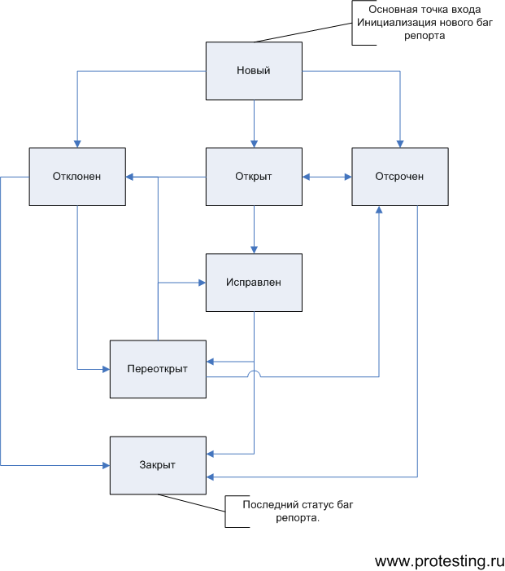
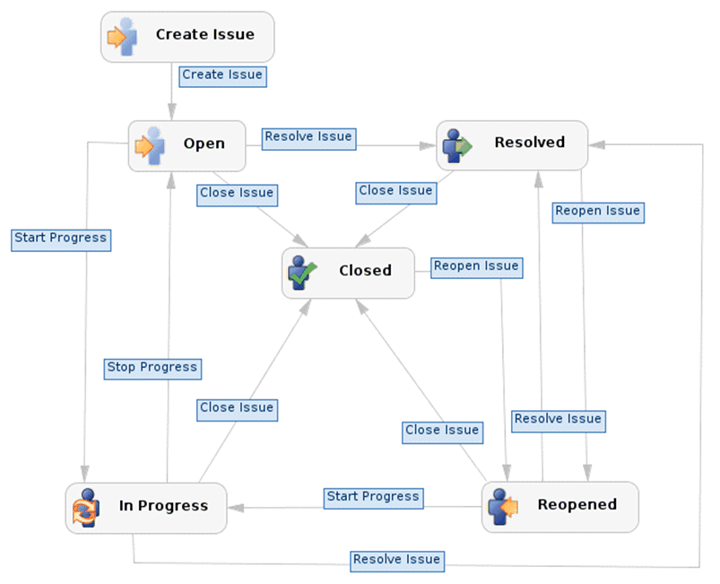

## Что такое тест кейс.

Это самая маленькая часть тест документации, это ситуация которая проверяет конкретно взятое условие из требований.

**Любой тест-кейс обязательно включает в себя:**

- **Уникальный идентификатор** — необходим для удобной организации хранения и навигации по нашим тест-наборам.
- **Название** — основная тема, или идея тест-кейса. Кратное описание его сути.
- **Предусловия** — описание условий, которые не имеют прямого отношения к проверяемому функционалу, но должны быть выполнены.  **_Например_**: оставить комментарий на вашем портале может только зарегистрированный пользователь. Значит для тест-кейса **«Создание комментария»** будет необходимо выполнение предусловия **«пользователь зарегистрирован»**, и **«пользователь авторизован»**
- **Шаги** — описание последовательности действий, которая должна привести нас к ожидаемому результату
- **Ожидаемый результат** — результат: что мы ожидаем увидеть после выполнения шагов.

**Каждый выполненный тест-кейс, дает нам один из трех результатов:**

1. **Положительный результат**, если фактический результат равен ожидаемому результату,
2. **Отрицательный результат**, если фактический результат не равен ожидаемому результату. В этом случае, найдена ошибка.
3. **Выполнение теста блокировано**, если после одного из шагов продолжение теста невозможно. В этом случае так же, найдена ошибка.

## Баг репорт

**Баг или дефект репорт** - это документ, описывающий ситуацию или последовательность действий приведшую к некорректной работе объекта тестирования, с указанием причин и ожидаемого результата.

> _Прочитав короткое описание бага (**Bug Summary**), я должен понять в чем состоит проблема, прочитав детальное описание бага (**Bug Description**) я должен знать строку кода, которую править. (с) Разработчик_

### Примерный шаблон **баг репорта**

#### Шапка

| | |
|--:|:--|
| Короткое описание (**Summary**)  | Короткое описание проблемы, явно указывающее на причину и тип ошибочной ситуации. |
| Проект (**Project**)             | Название тестируемого проекта. |
| Компонент приложения (**Component) | Название части или функции тестируемого продукта. |
| Номер версии (**Version**)           | Версия на которой была найдена ошибка. |
| Серьезность (**Severity**)           | Наиболее распространена пятиуровневая система градации серьезности дефекта. |
| Приоритет (**Priority**)             | Приоритет дефекта. |
| Статус (**Status**)                  | Статус бага. Зависит от используемой процедуры и жизненного цикла бага (bug workflow and life cycle). |
| Автор (**Author**)                   | Создатель баг репорта |
| Назначен на (**Assigned To**)	| Имя сотрудника, назначенного на решение проблемы |

#### Окружение

| | |
|--:|:--|
| ОС / Сервис Пак и т.д. / Браузера + версия / ... | Информация об окружении, на котором был найден баг: операционная система, сервис пак, для WEB тестирования - имя и версия браузера и т.д.|

#### Описание

| | |
|--:|:--|
| Шаги воспроизведения (**Steps to Reproduce**) | Шаги, по которым можно легко воспроизвести ситуацию, приведшую к ошибке. |
| Фактический Результат (**Result**)            | Результат, полученный после прохождения шагов к воспроизведению. |
| Ожидаемый результат (**Expected Result**)     | Ожидаемый правильный результат. |

#### Дополнения

| | |
|--:|:--|
| Прикрепленный файл (Attachment) | Файл с логами, скриншот или любой другой документ, который может помочь прояснить причину ошибки или указать на способ решения проблемы. |

#### Градация Серьезности дефекта (Severity)

**S1 Блокирующая (Blocker)**    
Блокирующая ошибка, приводящая приложение в нерабочее состояние, в результате которого дальнейшая работа с тестируемой системой или ее ключевыми функциями становится невозможна. Решение проблемы необходимо для дальнейшего функционирования системы.

**S2 Критическая (Critical)**    
Критическая ошибка, неправильно работающая ключевая бизнес логика, дыра в системе безопасности, проблема, приведшая к временному падению сервера или приводящая в нерабочее состояние некоторую часть системы, без возможности решения проблемы, используя другие входные точки. Решение проблемы необходимо для дальнейшей работы с ключевыми функциями тестируемой системой.

**S3 Значительная (Major)**    
Значительная ошибка, часть основной бизнес логики работает некорректно. Ошибка не критична или есть возможность для работы с тестируемой функцией, используя другие входные точки.

**S4 Незначительная (Minor)**   
Незначительная ошибка, не нарушающая бизнес логику тестируемой части приложения, очевидная проблема пользовательского интерфейса.

**S5 Тривиальная (Trivial)**    
Тривиальная ошибка, не касающаяся бизнес логики приложения, плохо воспроизводимая проблема, малозаметная посредствам пользовательского интерфейса, проблема сторонних библиотек или сервисов, проблема, не оказывающая никакого влияния на общее качество продукта.

#### Градация Приоритета дефекта (Priority)

**P1 Высокий (High)**    
Ошибка должна быть исправлена как можно быстрее, т.к. ее наличие является критической для проекта.

**P2 Средний (Medium)**    
Ошибка должна быть исправлена, ее наличие не является критичной, но требует обязательного решения.

**P3 Низкий (Low)**    
Ошибка должна быть исправлена, ее наличие не является критичной, и не требует срочного решения.

#### Жизненный цикл бага

Рассмотрим теперь по порядку каждый из вариантов.

1. **Отклонен**. В этом случае вы можете либо поспорить о судьбе вашего багрепорта, изменив статус на “Переоткрыт” либо закрыть его - статус **“Закрыт”**
2. **Отсрочен**. Баг репорт в статусе “Отсрочен” можно перевести в статус “Открыт”, когда потребуется исправление либо в статус **“Закрыт”**, если уже не потребуется.
3. **Открыт**. Именно в таком состоянии разработчик получает баг репорт для исправления. Он может отклонить (дальнейшие действия смотрите в пункте 1) или исправить баг. Баг репорт в статусе **“Исправлен”** переводится на тестировщика для проверки. В случае если проблема все еще воспроизводится, выставляется статус **“Переоткрыт”** и баг репорт направляется назад на доработку к разработчику. Если же исправление было успешным, то баг репорт переводится в статус **“Закрыт”**.

_**Примечание**_: данная схема сильно упрощена. В некоторых системах баг трекинга созданный баг репорт сразу получает статус **“Открыт”** без дополнительной валидации. Рассмотренный выше жизненный цикл основан на том, что в команде есть кто-то, ответственный за назначение баг репортов. В случае, если такой роли на проекте нет, то баги назначаются разработчиками самостоятельно, и тогда во избежании путанницы, есть смысл ввести еще один промежуточный статус “В разработке” (In progress), показывающий, что данный баг репорт уже назначен и находится на стадии исправления. Пример реализации подобного жизненного цикла на базе JIRA можно увидеть на следующем рисунке:

