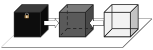

# Black box vs white box

## Black Box

**Summary**: Мы не знаем, как устроена тестируемая система.

Тестирование методом «черного ящика», также известное как тестирование, основанное на спецификации или тестирование поведения – техника тестирования, основанная на работе исключительно с внешними интерфейсами тестируемой системы.

**тестирование черного ящика – это:**

- тестирование, как функциональное, так и нефункциональное, не предполагающее знания внутреннего устройства компонента или системы.
- тест-дизайн, основанный на технике черного ящика – процедура написания или выбора тест-кейсов на основе анализа функциональной или нефункциональной спецификации компонента или системы  без знания ее внутреннего устройства.

**Целью этой техники является поиск ошибок в таких категориях:**

- неправильно реализованные или недостающие функции;
- ошибки интерфейса;
- ошибки в структурах данных или организации доступа к внешним базам данных;
- ошибки поведения или недостаточная производительности системы;

Таким образом, мы не имеем представления о структуре и внутреннем устройстве системы. Нужно концентрироваться на том, что программа делает, а не на том, как она это делает.

**Техники тест-дизайна, основанные на использования черного ящика, включают:**

- классы эквивалентности;
- анализ граничных значений;
- таблицы решений;
- диаграммы изменения состояния;
- тестирование всех пар.

**Преимущества:**

- тестирование производится с позиции конечного пользователя и может помочь обнаружить неточности и противоречия в спецификации;
- тестировщику нет необходимости знать языки программирования и углубляться в особенности реализации программы;
- тестирование может производиться специалистами, независимыми от отдела разработки, что помогает избежать предвзятого отношения;
- можно начинать писать тест-кейсы, как только готова спецификация.

**Недостатки:**

- тестируется только очень ограниченное количество путей выполнения программы;
- без четкой спецификации (а это скорее реальность на многих проектах) достаточно трудно составить эффективные тест-кейсы;
- некоторые тесты могут оказаться избыточными, если они уже были проведены разработчиком на уровне модульного тестирования;

## White Box

**Summary:** Нам известны все детали реализации тестируемой программы.

Тестирование методом белого ящика (также: прозрачного, открытого, стеклянного ящика; основанное на коде или структурное тестирование) – метод тестирования программного обеспечения, который предполагает, что внутренняя структура/устройство/реализация системы известны тестировщику. Мы выбираем входные значения, основываясь на знании кода, который будет их обрабатывать. Точно так же мы знаем, каким должен быть результат этой обработки. Знание всех особенностей тестируемой программы и ее реализации – обязательны для этой техники. Тестирование белого ящика – углубление во внутренне устройство системы, за пределы ее внешних интерфейсов.

**тестирование белого ящика – это:**

- тестирование, основанное на анализе внутренней структуры компонента или системы.
- тест-дизайн, основанный на технике белого ящика – процедура написания или выбора тест-кейсов на основе анализа внутреннего устройства системы или компонента.

**Преимущества:**

- тестирование может производиться на ранних этапах: нет необходимости ждать создания пользовательского интерфейса;
- можно провести более тщательное тестирование, с покрытием большого количества путей выполнения программы.

**Недостатки:**

- для выполнения тестирования белого ящика необходимо большое количество специальных знаний
- при использовании автоматизации тестирования на этом уровне, поддержка тестовых скриптов может оказаться достаточно накладной, если программа часто изменяется.

## Сравнение Black Box и White Box

| Критерий | Black Box | While Box |
|:--------:|:---------:|:---------:|
| Определение | Тестирование, как функциональное, так и не функциональное,не предпологающее знания внутреннего устройства компонента или системы | Тестирование, основанное на анализе внутренней структуры или системы |
| Уровни, к которым премениа техника| В основном: приемочное тестирование и системное тестирование| В основном: юнит тестирование и итеграционное тестирование |
| Кто выполняет | Как правило, тестировщик | Как правило, разработчик |
| Знание программирования | Не нужно | Необходимо |
| Знание реализации | Не нужно | Необходимо |
| Основа для тест-кейсов | Спецификация, требюования | Проектная документация |

## Grey Box

**Summary:** Нам известны только некоторые особенности реализации тестируемой системы.

Тестирование методом серого ящика – метод тестирования программного обеспечения, который предполагает, комбинацию White Box и Black Box подходов. То есть, внутреннее устройство программы нам известно лишь частично. Предполагается, например, доступ к внутренней структуре и алгоритмам работы ПО для написания максимально эффективных тест-кейсов, но само тестирование проводится с помощью техники черного ящика, то есть, с позиции пользователя.